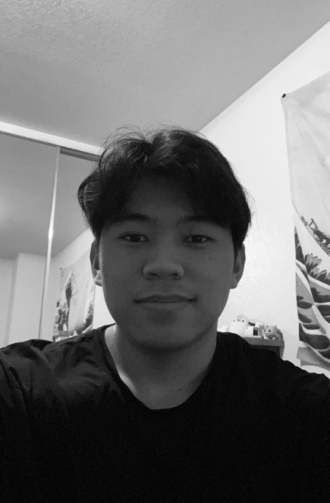

## Meet the Team! 

### Alexander Yu

Hello! My name is Alex Yu. I am currently an undergraduate Computer Engineering student at UC Davis. I was born and raised in Sacramento. Out of high school, I enlisted with the U.S. Army Reserve and served as a Cargo Specialist. Returning from training, I enrolled in community college where I started pursuing my love for computers and tech. 
I'm currently doing an eletrical engineering internship with Caltrans at the Transportation Management Center (TMC).

---
### Darren Animo

Hi! My name is Darren Animo. I am an undergraduate Computer Engineering student at UC Davis. I grew up in Sacramento, and knew from an early age that I wanted to work with computers so I enrolled in UC Davis after finishing high school and I am currently pursuing my bachelors degree in Computer Engineering.
