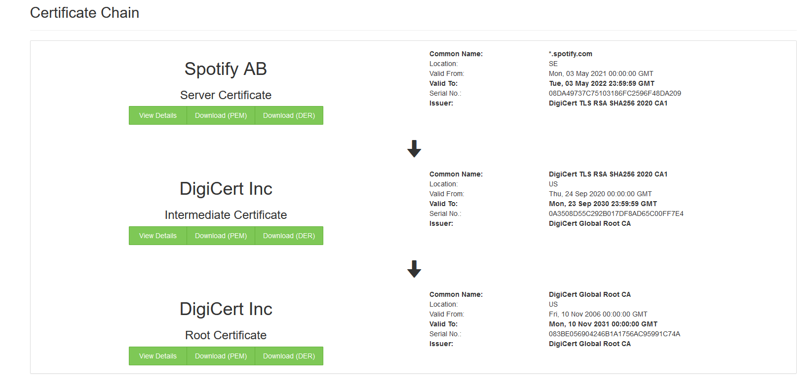
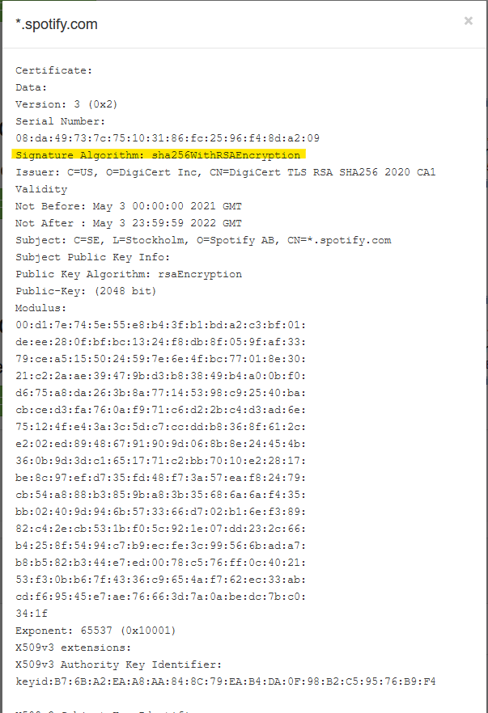
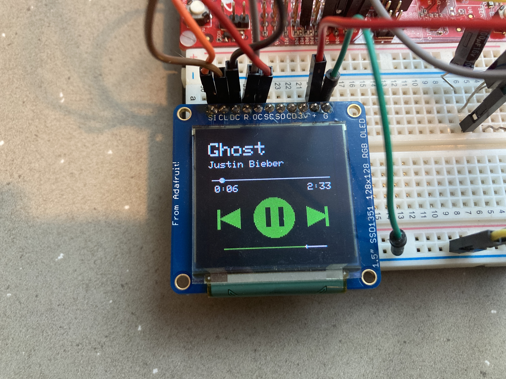

***
## Overview

**Materials**
***
#### Hardware Used: 
* CC3200 LaunchPad
* Adafruit OLED Breakout Board
* AT&T S10-S3 Remote Control
* Vishay TSOP31336 IR Receiver Module

#### Software Used: 
* Code Composer Studio
* TI Pin Mux Tool
* CC3200 SDK 

**Connecting to the Internet**

In a previous project, we connected to Amazon Web Services (AWS) with a few class provided functions. In this project, we decided to heavily rely on the web client library provided by the CC3200 SDK. This library has the advantage of better compatability with any type of website, secured or not, and provides an easy method to include the exact header we need in each https message. 
The first notable issue we ran into though was the limited size allocated to a single http header line.
```c

/* Configurable lengths */
#define CONTENT_BUFLEN 128
#define URI_BUFLEN 128
#define SEND_BUFLEN 128
#define MAX_FIELD_NAME_LEN 24
```

In httpcli.c,  the value of CONTENT_BUFLEN was too small to contain the authorization token portion of the http request. To resolve this, we had to rebuild the http client library with this value set to 512 and link this updated version to the rest of our project.

**Secure Connection**
To achieve secure connections, we utilized <a href="https://ssltools.com" target="_blank">ssltools</a> to find the appropriate root certificate for spotify. We found the following certificate chain:  and downloaded the compatable .der file from DigiCert Inc.
Selecting "View Details" under Spotify AB, we can see more information about the type of encryption it uses:


The above description shows that it uses SHA256 with RSA Encryption. 


**Spotify Authentication**
Before using any other parts of their api, Spotify requires authentication from the user and application through the following authorizaiton flow.


1. The app requests authorization to access api and/or user data
2. Spotify responds by requesting a user login at a developer specified redireciton URI
3. The user logs in to authorize access.
4. The app requests an access token and refresh token tied to the user
5. The app is now free to make API calls if they provide the access token.
6. The app can get new access tokens by re-requesting authorization providing the refresh token in place of user login.

Refresh tokens last as long as the user permits the application to access the the data. In light of this, we decided to <a href="https://developer.spotify.com/documentation/web-api/quick-start/" target="_blank">follow their guide</a> and create a tempory http server to host a one time user login. This provided us with a refresh token that will last as long as we want. 

**Spotify API**

Spotify provides full documentation of their web api on their developer website. 
<a href="https://developer.spotify.com/documentation/web-api/reference/#/" target="_blank">Full Spotify API Documentation Here!</a>


The API calls we chose to implement are provided as macro definitions below. 

``` c
#define PLAYSTATEHEADER      "/v1/me/player"
#define TRANSFERPLAYHEADER   "/v1/me/player"
#define CURRTRACKHEADER      "/v1/me/player/currently-playing"
#define GETDEVICESHEADER     "/v1/me/player/devices"
#define RESUMEHEADER         "/v1/me/player/play"
#define PAUSEHEADER          "/v1/me/player/pause"
#define SKIPNEXTHEADER       "/v1/me/player/next"
#define SKIPPREVHEADER       "/v1/me/player/previous"
#define SEEKZEROHEADER       "/v1/me/player/seek?position_ms=0"
#define VOLUMEHEADER         "/v1/me/player/volume?volume_percent="
```


****

To send data from Spotify about what task the user wants done, user input is collected through an IR remote control. Each button of the remote sends a different waveform to the IR receiver connected to our CC3200 LaunchPad. Using an onboard timer and GPIO pin interrupt the board can interpret these waveforms to determine what button on the remote the user pressed. Each waveform can be interpreted as a 32 bit integer which is unique for each button of the remote. This incoming value is then examined to determine which button was pressed by the user. Each button is mapped to a command to send to spotify so when pressed the command is sent.

**Displaying Data on the OLED**


The OLED display utilizes a modified version of Adafruit's [open source graphics library](http://www.adafruit.com/product/1431) made for Arduino. The modified library ports this code to a version that can be recognized by the CC3200. Our implementation utilized this library to create the interface for the OLED. The OLED displays the track name, artist, track length, volume level, and a media player interface for the user. The track name and artist are pulled directly from spotify, the track length is pulled from spotify in milliseconds and converted to minutes:seconds format for the display, and the rest of the display consists of controls the user can send to spotify.
